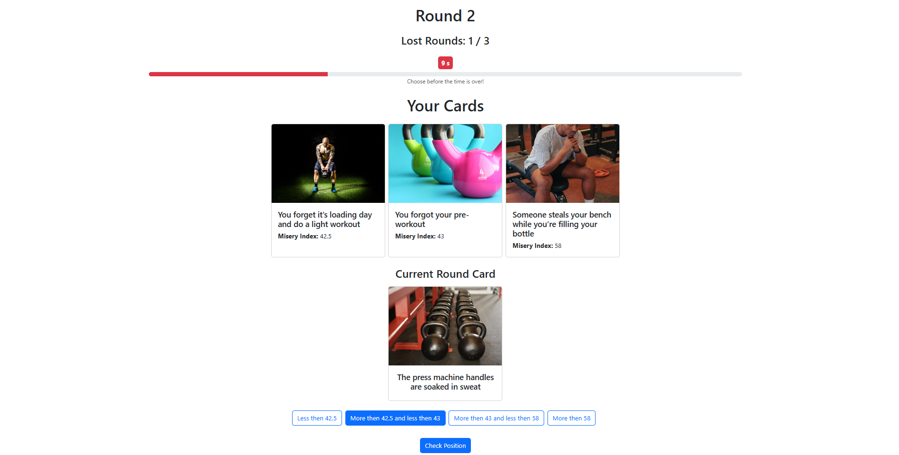
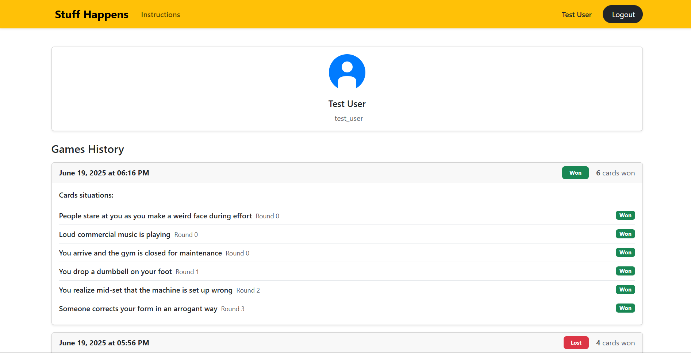

# Exam #1: "Gioco della Sfortuna"
## Student: s344007 Catalano Loris 

## React Client Application Routes

- Route `/`: HomePage - main page with game start options (play as guest, play as user, or login)
- Route `/login`: LoginPage - user authentication page
- Route `/game`: GamePage - main game interface where users play the cards game
- Route `/user`: UserPage - displays user profile and game history
- Route `/instructions`: InstructionsPage - game rules and instructions
- Route `*`: NotFoundPage - 404 error page for undefined routes

## API Server

- POST `/api/v1/login`
  - request body: `{ "username": "string", "password": "string" }`
  - response body: `{ "message": "Login successful", "user": { "id": number, "name": "string", "username": "string" } }` or `{ "message": "Login failed" }`

- POST `/api/v1/logout`
  - requires authentication
  - request body: none
  - response body: `{ "message": "Logout successful" }` or `{ "message": "Logout failed", "error": "string" }`

- GET `/api/v1/user`
  - requires authentication
  - request parameters: none
  - response body: `{ "user": { "id": number, "name": "string", "username": "string" } }`

- GET `/api/v1/user/history`
  - requires authentication
  - request parameters: none
  - response body: array of user's game history with detailed game information including cards played

- POST `/api/v1/game/startGame`
  - request body: none (user ID taken from session, if not provided starts demo game)
  - response body: `{ "isDemo": boolean, "initialCards": [{ "cardId": number, "imageUrl": "string", "situationName": "string", "miseryIndex": number }] }`

- POST `/api/v1/game/checkPosition`
  - requires active game session, subject to 30-second timer
  - request body: `{ "cardPositionId": number }`
  - response body: 
    - Success: `{ "isCorrect": boolean, "roundCards": array, "roundNumber": number, "finished": boolean }`
    - Win: `{ "message": "You won the game!", "roundCards": array, "roundNumber": number, "finished": true }`
    - Loss: `{ "message": "Game Over", "finished": true }`
    - Timer expired: `{ "error": "Timer expired" }`

- POST `/api/v1/game/newRound`
  - requires active game session
  - request body: none
  - response body: `{ "nextCard": { "cardId": number, "imageUrl": "string", "situationName": "string" }, "roundNumber": number }` or `{ "message": "Demo finished" }`

## Database Tables

- Table `users` - contains user account information including id, name, username, hashed password and salt for authentication
- Table `cards` - contains gym situation cards with id, imageUrl, situationName, and unique miseryIndex (real number representing difficulty/misery level)
- Table `games` - contains game records with id, userId (foreign key), isDemo flag, status (active/finished/quitted), rounds played, start/end timestamps, and result (won/lost)
- Table `game_cards` - junction table linking games to cards, tracking gameId, cardId, roundNumber when card was played, won status, and isInitial flag (whether card was part of starting hand)

## Main React Components

- `NavBar`: Navigation bar component with authentication status, user info display, and navigation links to instructions page. Hidden during gameplay for better user experience.
- `GameRecap`: Post-game component that displays the final cards sequence and game result (won/lost), with option to return to home page.
- `AuthContext`: React context provider for managing user authentication state throughout the application.
- `HomePage`: Landing page with options to start game.
- `GamePage`: Core game interface handling card placement logic, timer, and round progression.
- `UserPage`: User profile page displaying game history and statistics for authenticated users.
- `LoginPage`: User authentication interface.
- `InstructionsPage`: Game rules and instructions.

## Screenshot
### Game 

### Profile

## Users Credentials

- test_user, password (Test User)
- demo_user, password (Demo User)